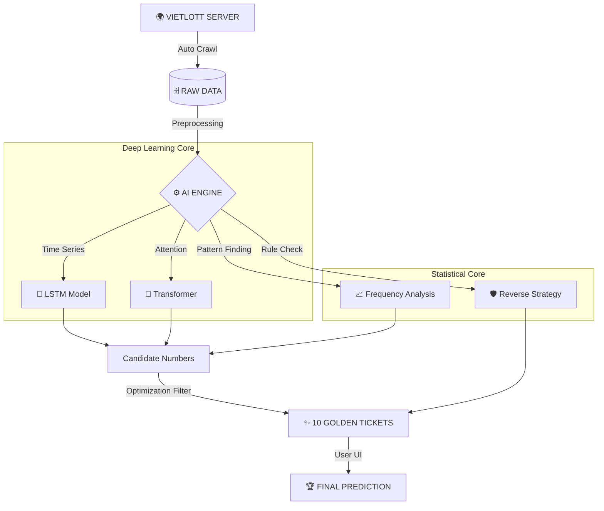

# 🎰 VIETLOTT AI PREDICTOR PRO

<div align="center">


**HỆ THỐNG DỰ ĐOÁN XỔ SỐ KHOA HỌC DỮ LIỆU & DEEP LEARNING**

[TÍNH NĂNG](#-tính-năng-nổi-bật) • [CÀI ĐẶT](#-cài-đặt-nhanh) • [NGUYÊN LÝ](#-kiến-trúc-hệ-thống)

</div>

---

## 🔥 GIỚI THIỆU

> **"Dữ liệu không biết nói dối."**

**Vietlott AI Predictor Pro** (v11.5) là dự án **Data Science** chuyên sâu, áp dụng các mô hình học sâu (Deep Learning) hiện đại nhất để giải mã các quy luật thống kê của xổ số Vietlott.

Không dùng tâm linh, không đoán mò. Chúng tôi sử dụng **Toán học** và **Mạng Neron Nhân tạo** để tìm ra cơ hội chiến thắng cao nhất.

---

## 🚀 TÍNH NĂNG NỔI BẬT

### 🧠 1. Deep Learning Core (Lõi AI)
- **LSTM (Long Short-Term Memory)**: Mạng neron đặc biệt có khả năng "nhớ" chuỗi lịch sử dài hạn, chuyên dùng để dự báo chuỗi thời gian (Time-series Forecasting).
- **Transformer (Attention Mechanism)**: Công nghệ đứng sau ChatGPT, giúp mô hình tập trung vào các kỳ quay có "trọng số" quan trọng nhất.

### 🕵️ 2. Chiến lược Phân tích ngược (Reverse Engineering)
- **Kiểm định Chi-Square**: Xác định độ ngẫu nhiên thực sự của lồng cầu.
- **Phát hiện Bất thường**: Tìm ra các dấu hiệu lạ trong phân bố tổng, chẵn/lẻ.
- **Lọc số thông minh (Smart Filter)**: Tự động loại bỏ >90% các bộ số có xác suất trúng cực thấp (Outliers).

### 🖥️ 3. Giao diện Chuyên nghiệp
- **Dark Mode**: Giao diện tối hiện đại, bảo vệ mắt.
- **Real-time Audit**: Tự động kiểm tra kết quả ngay khi có kỳ quay mới.
- **1-Click**: Mọi thao tác Soi cầu, Cập nhật, Kiểm tra chỉ với 1 cú click.

---

## 🏗 KIẾN TRÚC HỆ THỐNG

Dưới đây là sơ đồ xử lý dữ liệu (Data Pipeline) của hệ thống:



---

## 🛠 CÀI ĐẶT NHANH

### Yêu cầu hệ thống
*   **Hệ điều hành**: Windows 10/11
*   **Python**: 3.10 trở lên
*   **RAM**: Tối thiểu 4GB (Khuyến nghị 8GB)

### Hướng dẫn 3 bước

1.  **Tải mã nguồn về máy:**
    ```bash
    git clone https://github.com/vandang890615/vietlott.git
    cd vietlott
    ```

2.  **Cài đặt thư viện:**
    ```bash
    pip install -r requirements.txt
    ```

3.  **Khởi chạy phần mềm:**
    *   Chạy file **`MO_PHAN_MEM.bat`** (Click đúp chuột).
    *   Hoặc chạy lệnh: `python src/vietlott/predictor/gui_app.py`

---

## ⚠️ MIỄN TRỪ TRÁCH NHIỆM (DISCLAIMER)

> **Dự án này phục vụ mục đích NGHIÊN CỨU & HỌC TẬP.**
>
> 1.  Xổ số là trò chơi có tính ngẫu nhiên cao.
> 2.  Không có công cụ nào đảm bảo chiến thắng 100%.
> 3.  Chúng tôi không khuyến khích hành vi cờ bạc thiếu kiểm soát.
> 4.  Hãy sử dụng phần mềm có trách nhiệm!

---

<div align="center">

**Developed with ❤️ by VanDang**
*© 2026 All Rights Reserved*

</div>