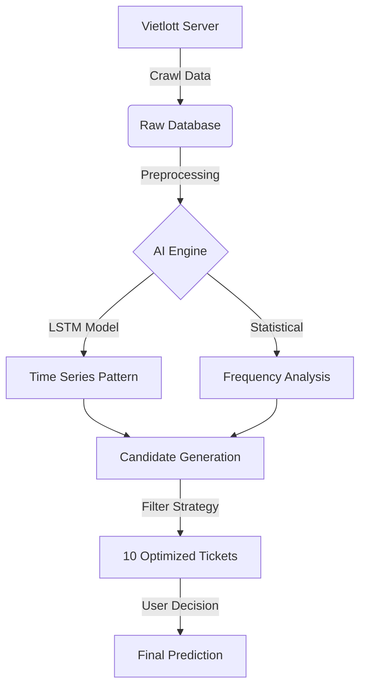

# � VIETLOTT AI PREDICTOR PRO

<div align="center">

[](https://www.python.org/)
[](https://www.tensorflow.org/)
[](LICENSE)
[](https://github.com/vandang890615/vietlott/graphs/commit-activity)

**HỆ THỐNG DỰ ĐOÁN XỔ SỐ KHOA HỌC DỮ LIỆU ĐỈNH CAO**
*Sự kết hợp hoàn hảo giữa LSTM Deep Learning & Chiến lược Phân tích ngược (Reverse Engineering)*

[Tính Năng](#-tính-năng-đột-phá) • [Cài Đặt](#-cài-đặt-nhanh) • [Hướng Dẫn](#-hướng-dẫn-sử-dụng) • [Nguyên Lý](#-công-nghệ-cốt-lõi)

</div>

---

## � GIỚI THIỆU

> **"Không có gì là ngẫu nhiên hoàn toàn nếu bạn có đủ dữ liệu."**

**Vietlott AI Predictor Pro** (v11.5) không phải là một công cụ đoán mò. Đây là một dự án **Data Science** nghiêm túc, được thiết kế để giải mã các quy luật ẩn sau những con số của Vietlott Mega 6/45 và Power 6/55.

Hệ thống hoạt động như một cỗ máy khai phá dữ liệu (Data Mining), liên tục học hỏi từ >1000 kỳ quay trong quá khứ để tìm ra những khuôn mẫu mà mắt thường không thể nhìn thấy.

---

## 🚀 TÍNH NĂNG ĐỘT PHÁ

### 🧠 1. Trí Tuệ Nhân Tạo (AI Core)
*   **LSTM Neural Network**: Mạng neron ghi nhớ chuỗi dài, chuyên trị các dữ liệu thời gian (Time-series) như thị trường chứng khoán hay xổ số.
*   **Transformer Attention**: Cơ chế "sự chú ý" giúp AI tập trung vào các kỳ quay có tầm ảnh hưởng lớn nhất trong lịch sử.

### �️ 2. Chiến lược Phân tích ngược (Reverse Engineering)
*   **Randomness Test**: Kiểm tra độ ngẫu nhiên của lồng cầu bằng thuật toán Chi-Square.
*   **Anomaly Detection**: Phát hiện các dấu hiệu bất thường về Tổng, Chẵn/Lẻ, và Tần suất xuất hiện.
*   **Smart Filter**: Loại bỏ 95% các bộ số "rác" (như 1-2-3-4-5-6) để tối ưu hóa cơ hội.

### � 3. Hệ thống Audit & Tracking
*   **Real-time Audit**: Tự động đối soát kết quả ngay khi có kỳ quay mới.
*   **Win/Loss History**: Lưu trữ lịch sử dự đoán minh bạch, không thể gian lận.

### �️ 4. Giao diện Người dùng (GUI)
*   **Dark Mode**: Giao diện tối hiện đại, dịu mắt.
*   **Live Countdown**: Đếm ngược từng giây đến giờ quay thưởng.
*   **One-Click Operation**: Mọi thao tác phức tạp chỉ gói gọn trong 1 cú click chuột.

---

## 🛠 CÀI ĐẶT NHANH

### Yêu cầu hệ thống
| Thành phần       | Yêu cầu tối thiểu | Khuyến nghị             |
| :--------------- | :---------------- | :---------------------- |
| **Hệ điều hành** | Windows 10        | Windows 11              |
| **Python**       | 3.10              | 3.11+                   |
| **RAM**          | 4 GB              | 8 GB+                   |
| **Internet**     | Có                | Ổn định (để crawl data) |

### 3 Bước Cài Đặt

1.  **Tải mã nguồn:**
    ```bash
    git clone https://github.com/vandang890615/vietlott.git
    cd vietlott
    ```

2.  **Cài đặt thư viện:**
    ```bash
    pip install -r requirements.txt
    ```

3.  **Khởi chạy:**
    *   Cách 1: Chạy file `MO_PHAN_MEM.bat` (Khuyên dùng)
    *   Cách 2: `python src/vietlott/predictor/gui_app.py`

---

## � HƯỚNG DẪN SỬ DỤNG

### Quy trình "Chuẩn Pro" hàng ngày:

1.  🟢 **BƯỚC 1: CẬP NHẬT (18h45)**
    *   Mở app, bấm `CẬP NHẬT KẾT QUẢ MỚI`.
    *   Hệ thống sẽ tải kết quả vừa quay từ server Vietlott.

2.  🟡 **BƯỚC 2: AUDIT**
    *   Bấm `KIỂM TRA DỰ ĐOÁN`.
    *   Xem AI đã dự đoán đúng bao nhiêu số ở kỳ trước.

3.  🔴 **BƯỚC 3: PHÂN TÍCH (Trước 18h00 hôm sau)**
    *   Bấm `PHÂN TÍCH CHUYÊN SÂU`.
    *   Chọn loại vé (Mega/Power).
    *   Chờ AI "nghiền ngẫm" dữ liệu và xuất ra **10 Bộ Số Vàng**.
    *   Bấm `YES` để chốt số.

---

## 🔬 CÔNG NGHỆ CỐT LÕI

Dưới đây là sơ đồ luồng xử lý của hệ thống:



---

## ⚠️ MIỄN TRỪ TRÁCH NHIỆM

> **DISCLAIMER:**
>
> Dự án này được xây dựng với mục đích **NGHIÊN CỨU KHOA HỌC DỮ LIỆU**.
> *   Xổ số Vietlott về bản chất là trò chơi có xác suất ngẫu nhiên cao.
> *   Không có thuật toán nào trên thế giới đảm bảo chiến thắng 100%.
> *   Chúng tôi **không khuyến khích** bài bạc hay cá độ dưới mọi hình thức.
> *   **Hãy chơi có trách nhiệm và chỉ chơi cho vui!**

---

<div align="center">

**Developed with ❤️ & 🧠 by VanDang**
*© 2026 All Rights Reserved*

[⬆ Về đầu trang](#-vietlott-ai-predictor-pro)

</div>
