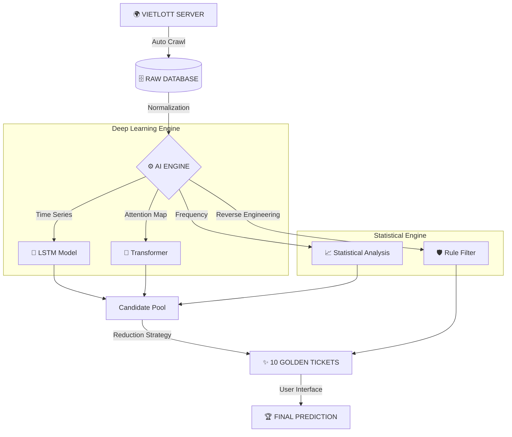

<div align="center">


**HỆ THỐNG DỰ ĐOÁN XỔ SỐ THÔNG MINH SỬ DỤNG MẠNG NERON & PHÂN TÍCH THỐNG KÊ**

[DỰ ÁN](#-giới-thiệu) • [TÍNH NĂNG](#-tính-năng-đột-phá) • [CÀI ĐẶT](#-hướng-dẫn-cài-đặt) • [KIẾN TRÚC](#-kiến-trúc-hệ-thống)

</div>

---

## 🚀 GIỚI THIỆU

> **"Dữ liệu không biết nói dối nếu chúng ta biết cách lắng nghe."**

**Vietlott AI Predictor Pro** không chỉ là một công cụ soi cầu thông thường. Đây là một hệ thống **nghiên cứu khoa học dữ liệu (Data Science)** áp dụng các mô hình học sâu (Deep Learning) tiên tiến nhất để tìm kiếm các quy luật ẩn sau những con số tưởng chừng như ngẫu nhiên.

Sự kết hợp giữa **LSTM (Long Short-Term Memory)**, **Transformer (Attention Mechanism)** và **Reverse Engineering Strategy** mang lại cái nhìn hoàn toàn mới về xác suất trúng thưởng.

---


### 🧠 1. Deep Learning Core (Lõi AI)
*   **LSTM Neural Network**: Mạng neron hồi quy giúp ghi nhớ chuỗi lịch sử dài hạn, phát hiện xu hướng lặp lại và sự biến thiên của các bộ số qua hàng ngàn kỳ quay.
*   **Transformer Model**: Sử dụng cơ chế Attention (tương tự công nghệ của ChatGPT) để tìm ra mối liên hệ phức tạp giữa các kỳ quay xa nhau mà mắt thường không thể nhận ra.

### 🔍 2. Advanced Reverse Engineering (Phân tích ngược)
*   **Kiểm định tính ngẫu nhiên (Randomness Test)**: Sử dụng thuật toán Chi-Square và Autocorrelation để phân tích độ tin cậy của dữ liệu đầu vào.
*   **Phát hiện quy luật ẩn**: Tìm kiếm các khuôn mẫu như Position Bias (Thiên vị vị trí), Sum Control (Kiểm soát tổng), và Cold Numbers (Số gan).
*   **Smart Filter Strategy**: Thay vì đoán mò, hệ thống sử dụng bộ lọc thông minh để loại bỏ hàng triệu bộ số có xác suất cực thấp, chỉ giữ lại các bộ số nằm trong "vùng nóng" thống kê.

### 🛡️ 3. Hệ thống Audit & Minh bạch
*   **Tự động đối soát**: Ngay khi có kết quả mới, hệ thống sẽ tự động so khớp với dự đoán kỳ trước để đánh giá hiệu suất.
*   **Lịch sử vĩnh viễn**: Mọi dự đoán đều được lưu lại trong `audit_log.json`, đảm bảo tính trung thực (không thể sửa kết quả sau khi đã quay thưởng).

### 🖥️ 4. Professional GUI (Giao diện Chuyên nghiệp)
*   **Dark Mode**: Thiết kế tối hiện đại, tập trung vào dữ liệu và bảo vệ thị giác.
*   **Real-time Countdown**: Đếm ngược thời gian thực đến từng giây trước giờ quay thưởng của Mega 6/45 và Power 6/55.
*   **Xử lý đa luồng (Multi-threading)**: Ứng dụng luôn mượt mà trong khi AI đang thực hiện hàng tỷ phép tính huấn luyện ở nền.

---


Sơ đồ luồng xử lý dữ liệu (Data Pipeline) từ khi lấy kết quả đến khi đưa ra gợi ý:



---


### Yêu cầu hệ thống
*   **OS**: Windows 10/11 (Được tối ưu tốt nhất).
*   **Python**: Phiên bản 3.10 trở lên.
*   **RAM**: Tối thiểu 4GB (Khuyến nghị 8GB để huấn luyện mô hình mượt mà).

### Hướng dẫn 3 bước
1.  **Tải mã nguồn:**
    ```bash
    git clone https://github.com/vandang890615/vietlott.git
    cd vietlott
    ```
2.  **Cài đặt thư viện:**
    ```bash
    pip install -r requirements.txt
    ```
3.  **Khởi chạy:**
    *   Chạy file **`MO_PHAN_MEM.bat`** (Click đúp chuột).
    *   Hoặc lệnh: `python src/vietlott/predictor/gui_app.py`

---

## 📈 STAR HISTORY

<div align="center">

[](https://star-history.com/#vandang890615/vietlott&Date)

</div>

---

## ⚠️ MIỄN TRỪ TRÁCH NHIỆM (DISCLAIMER)

> **LƯU Ý QUAN TRỌNG**: Dự án này được phát triển với mục đích **NGHIÊN CỨU KHOA HỌC & GIÁO DỤC** về Data Science và Machine Learning.
> 
> *   Xổ số Vietlott về bản chất là trò chơi may rủi.
> *   Không có thuật toán nào đảm bảo chiến thắng 100%.
> *   Tác giả không chịu trách nhiệm về bất kỳ thiệt hại tài chính nào từ việc sử dụng phần mềm.
> *   **Vui lòng chơi chừng mực và có trách nhiệm.**

---

<div align="center">

**Developed with ❤️ by VanDang**
*© 2026 All Rights Reserved*

</div>