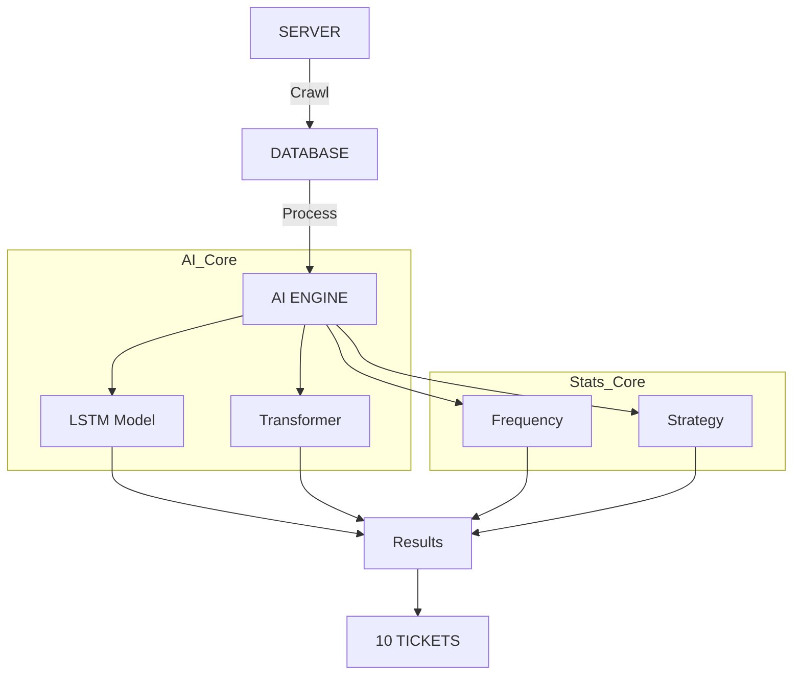

# 🎰 VIETLOTT AI PREDICTOR PRO

**HỆ THỐNG DỰ ĐOÁN XỔ SỐ KHOA HỌC DỮ LIỆU & DEEP LEARNING**

[TÍNH NĂNG](#-tính-năng-nổi- bật) • [CÀI ĐẶT](#-cài-đặt-nhanh) • [NGUYÊN LÝ](#-kiến-trúc-hệ-thống)

---

## 🔥 GIỚI THIỆU

> **"Dữ liệu không biết nói dối."**

**Vietlott AI Predictor Pro** (v11.5) là dự án **Data Science** chuyên sâu, áp dụng các mô hình học sâu (Deep Learning) hiện đại nhất để giải mã các quy luật thống kê của xổ số Vietlott.

Không dùng tâm linh, không đoán mò. Chúng tôi sử dụng **Toán học** và **Mạng Neron Nhân tạo** để tìm ra cơ hội chiến thắng cao nhất.

---

## 🚀 TÍNH NĂNG NỔI BẬT

### 🧠 1. Deep Learning Core
- **LSTM (Long Short-Term Memory)**: Mạng neron có khả năng "nhớ" chuỗi lịch sử dài hạn, chuyên dùng để dự báo chuỗi thời gian.
- **Transformer (Attention Mechanism)**: Công nghệ giúp mô hình tập trung vào các kỳ quay quan trọng nhất.

### 🕵️ 2. Chiến lược Phân tích ngược
- **Kiểm định Chi-Square**: Xác định độ ngẫu nhiên của lồng cầu.
- **Phát hiện Bất thường**: Tìm ra các dấu hiệu lạ trong phân bố kết quả.
- **Lọc số thông minh**: Tự động loại bỏ >90% các bộ số có xác suất trúng thấp.

### 🖥️ 3. Giao diện Chuyên nghiệp
- **Dark Mode**: Giao diện tối hiện đại, chuyên nghiệp.
- **Real-time Audit**: Tự động kiểm tra kết quả ngay khi có kỳ quay mới.
- **Tiện lợi**: Thao tác Soi cầu, Cập nhật chỉ với 1 cú click.

---

## 🏗 KIẾN TRÚC HỆ THỐNG

---

## 🛠 CÀI ĐẶT NHANH

### Yêu cầu hệ thống
* **Hệ điều hành**: Windows 10/11
* **Python**: 3.10 trở lên
* **RAM**: Tối thiểu 4GB

### Hướng dẫn sử dụng
1. **Tải mã nguồn về máy**
2. **Cài đặt thư viện**: `pip install -r requirements.txt`
3. **Mở phần mềm**: Chạy file `MO_PHAN_MEM.bat`

---

## 📈 STAR HISTORY

---

## ⚠️ MIỄN TRỪ TRÁCH NHIỆM

> **Dự án này phục vụ mục đích NGHIÊN CỨU & HỌC TẬP.**
> Xổ số có tính ngẫu nhiên cao. Không có công cụ nào đảm bảo trúng 100%. Hãy chơi có trách nhiệm!

---

**Developed with ❤️ by VanDang**
*© 2026 All Rights Reserved*

